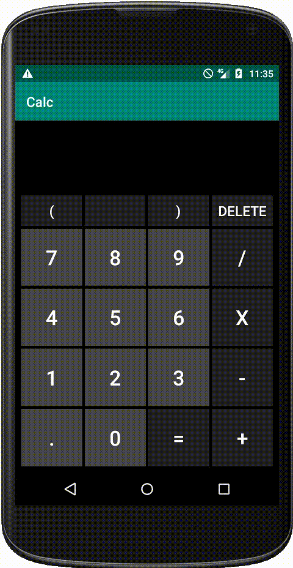

# Calculator App

안드로이드 계산기 앱

## Info

- 안드로이드에서 사칙연산을 할 수 있는 계산기 앱입니다.
- `(`, `)`를 지원합니다.
- `C#` 버전은 [여기](https://github.com/Sotaneum/Eesy-Cel)를 참조하세요.
  
## Finally

- 안드로이드 공부를 하면서 구현한 앱입니다.

## Copyright

- 비상업적 용도로 사용 가능하며 링크를 반드시 포함해주세요.
- 문제가 되는 내용이 있다면 언제든지 [`issue`](https://github.com/Sotaneum/Calculator-App/issues/new), [`Pull requests`](https://github.com/Sotaneum/Calculator-App/compare) 부탁드립니다.
